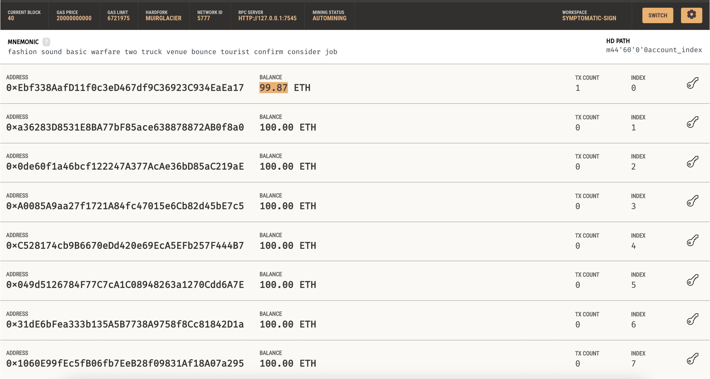
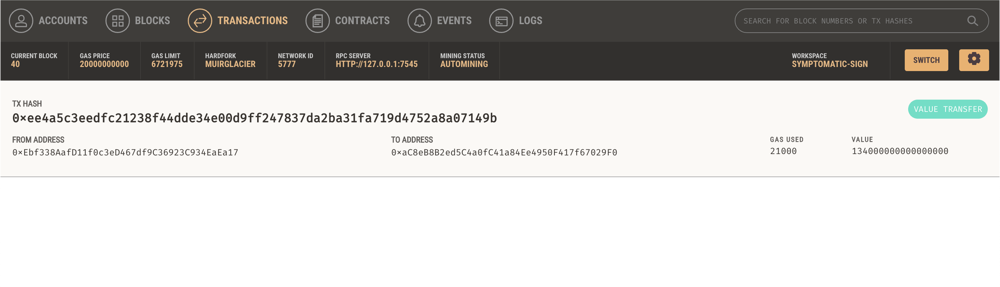

# Fintech Finder Cryptocurrency Wallet


Fintech Finder is a disruptive platform that connects customers with fintech professionals for hire and enables instant cryptocurrency payments. This README.md file provides an overview of the Fintech Finder Cryptocurrency Wallet and instructions for integrating it into your application.

## Table of Contents

- [Overview](#overview)
- [Features](#features)
- [Installation](#installation)
- [Usage](#usage)
- [Screenshots](#screenshots)
- [License](#license)

## Overview

The Fintech Finder application is a web-based platform that allows customers to find and hire fintech professionals. As the lead developer, you have integrated the Ethereum blockchain network into the application to enable customers to pay the hired professionals with cryptocurrency. In this challenge, you will assume the perspective of a Fintech Finder customer and complete the code to send cryptocurrency payments to the professionals

The program showcases several technologies and skills related to blockchain development and web application development. Here are some of the key technologies and skills demonstrated:

- Ethereum Blockchain: The program integrates with the Ethereum blockchain network to enable cryptocurrency payments. It demonstrates the use of Ethereum accounts, transaction signing, and interacting with the blockchain through the web3.py library.

- Streamlit: The program utilizes Streamlit, a Python library for building interactive web applications, to create the customer interface. Streamlit simplifies the process of creating web-based user interfaces and enables the display of dynamic content.

- Python: The program is primarily written in Python, leveraging its extensive libraries and frameworks. Python is a versatile programming language commonly used for web development, data analysis, and scripting tasks.

- Web Development: The program involves web development concepts such as creating a user interface, handling user input, and displaying real-time information. It showcases the use of HTML, CSS, and JavaScript through the Streamlit framework.

- Cryptocurrency Transactions: The program demonstrates the process of creating, signing, and sending cryptocurrency transactions using Ethereum. It showcases skills related to handling digital wallets, calculating transaction values, and interacting with blockchain networks.

- API Integration: The program integrates with external APIs, such as the Ganache blockchain network, to retrieve blockchain transaction information and display it to the user.

- Ganache: The program interacts with the Ganache personal Ethereum blockchain network, which provides a local development environment for testing and simulating blockchain transactions. It showcases the ability to connect to a specific blockchain network and retrieve transaction details.

- Reading and Writing Files: The program reads the mnemonic seed phrase from a file (.env) and saves screenshots to the README.md file. It demonstrates skills related to reading and writing files in Python.

These technologies and skills collectively enable the program to create a web-based application that integrates with the Ethereum blockchain, calculates cryptocurrency payments, and provides a user-friendly interface for interacting with the system.

## Features

The application consists of two Python files: fintech_finder.py and crypto_wallet.py. The fintech_finder.py file contains the web interface code for the application, while the crypto_wallet.py file contains the Ethereum transaction functions.

- Generate a new Ethereum account instance using a mnemonic seed phrase.
- Fetch and display the account balance associated with the Ethereum account address.
- Calculate the total value of an Ethereum transaction, including gas estimate, to pay a fintech professional.
- Digitally sign a transaction that pays a fintech professional and send it to the Ganache blockchain.
- Review the transaction hash code associated with the validated blockchain transaction.

Fintech Finder customers will select a fintech professional from the application interface’s drop-down menu, and then input the amount of time for which they’ll hire the worker. Code the application so that once a customer completes these steps, the application will calculate the amount that the worker will be paid in ether. To do so, complete the following steps:


## Installation

1. Clone the repository:

   ```shell
   git clone https://github.com/your-username/fintech-finder-wallet.git
   ```

2. Install the dependencies:

   ```shell
   pip install -r requirements.txt
   ```

3. Set up your environment:

   - Rename the `SAMPLE.env` file to `.env`.
   - Open the `.env` file and add your mnemonic seed phrase provided by Ganache.

## Usage

1. Start the application:

   ```shell
   streamlit run fintech_finder.py
   ```

2. Open the application in your browser by visiting `http://localhost:8501`.

3. The sidebar displays your Ethereum account address and the corresponding balance.

4. Select a fintech professional from the dropdown menu.

5. Enter the number of hours you want to hire the selected candidate.

6. The total wage in Ether will be calculated and displayed in the sidebar.

7. Click the "Send Transaction" button to pay the fintech professional. The transaction hash will be displayed in the sidebar.

8. After sending the transaction, navigate to the Ganache blockchain and review the transaction details.

## Screenshots


### Account Balance



*Screenshot of Account Balance in Ganache*
### Transaction Details



*Screenshot of Transaction Details in Ganache*

### Application Demonstration


*GIF displaying the application being used*

## License

This project is licensed under the MIT License. See the [LICENSE](LICENSE) file for details.
